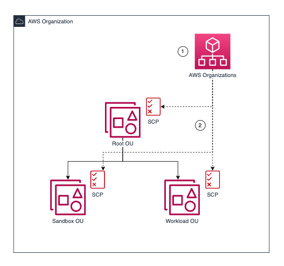

## aws-scps-with-terraform

This pattern will use Terraform to: 

1. Setup a template to easily create and apply [Service Control Policies (SCPs)](https://docs.aws.amazon.com/organizations/latest/userguide/orgs_manage_policies_scps.html) programmatically
2.  Deploy the following SCPs:

| SCP | OU | description | 
| --- | --- | --- | 
| allow_services | root | an allow list of specific AWS services | 
| root_policy | root | prohibit accounts from leaving the organization, creating new IAM users, creating new IAM access keys, and changes to billing details. Deny root user actions and deny external principals.  | 
| sandbox | sandbox | protect sandbox accounts from using services that could be a security risk or incur significant cost | 
| protect_guardduty | workload | deny the deletion of GuardDuty resources. | 

>**These policies are to demonstrate how SCPs can be deployed to different OUs using Terraform. Before deploying to your own accounts you should carefully consider which preventative controls are appropriate for you.** 

Example policies are inlcuded in the `policies/scp_examples` directory. These include forcing EC2 encryption, protecting CloudWatch logs, denying creation of default VPCs, and protecting Config resources.

## Prerequisites

- [AWS Organizations](https://docs.aws.amazon.com/organizations/latest/userguide/orgs_introduction.html)
- [AWS CLI](https://docs.aws.amazon.com/cli/latest/userguide/getting-started-install.html)
- [Terraform](https://learn.hashicorp.com/tutorials/terraform/install-cli)

## Limitations

- [SCP Service Limits](https://docs.aws.amazon.com/organizations/latest/userguide/orgs_reference_limits.html) for SCPs. 
- SCPs are a preventative control and can have unintended consequences. Ensure you have a good knowledge of AWS Organizations and Terraform before you deploy this pattern, especially to production environments. 

## Architecture
The pattern will be deployed from a local Repository, using Terraform. 

1. SCPs are created in AWS Organizations
2. These SCPs are then applied to Organizational Units (OUs). 

This pattern defaults to SCPs for Root, Sandbox, and Workload. But this can be fully customized. 

## Epics

### (Optional) Add or Edit the OUs 
Add, edit or remove the OUs.
| Story | Description |
|---|---|
| Update modules | Add a new module block or edit an existing module in `main.tf`. Rename the module and change the values for `for_each` file location and `ou_list` variable. 
| Update directories | In the `policies` folder, create a new folder or edit an existing folder with the same name used in the module block. This folder will be used for the SCP `json` files. 
| Edit variables | Create a new variable or edit an existing variable in `variables.tf` to the same name used in the module block. 
| Define variables | Add or edit the OU IDs in `config.auto.tfvars`. Multiple IDs can be included as a list of strings. 

### (Optional) Add or Edit the SCPs
Add, edit or remove the SCP used. These are stored as `json` files in the directories within `policies`. 
| Story | Description |
|---|---|
| Add a SCP | Create a new `json` file in the correct directory within `policies`. The location depends on the `for_each` file location in `main.tf`. Multiple SCPs can be added per directory. | 
| Edit a SCP | Edit the relevant `json` file in the `policies` directories. | 

### Deploy the pattern
Define the mandatory variables and deploy the pattern. 
| Story | Description |
|---|---|
| Define deployment region | Set region `config.auto.tfvars` |
| Define OUs | Add or edit the OU IDs in `config.auto.tfvars`. Multiple IDs can be included as a list of strings.  |
| Deploy SCPs | Initialize the directory and apply |

## Related Resources

- [SCPs (AWS Organizations User Guide)](https://docs.aws.amazon.com/organizations/latest/userguide/orgs_manage_policies_scps.html)
- [Resource: aws_organizations_policy](https://registry.terraform.io/providers/hashicorp/aws/latest/docs/resources/organizations_policy)
- [Resource: aws_organizations_policy_attachment](https://registry.terraform.io/providers/hashicorp/aws/latest/docs/resources/organizations_policy_attachment)

## Security

See [CONTRIBUTING](CONTRIBUTING.md#security-issue-notifications) for more information.

## License

This library is licensed under the MIT-0 License. See the LICENSE file.

